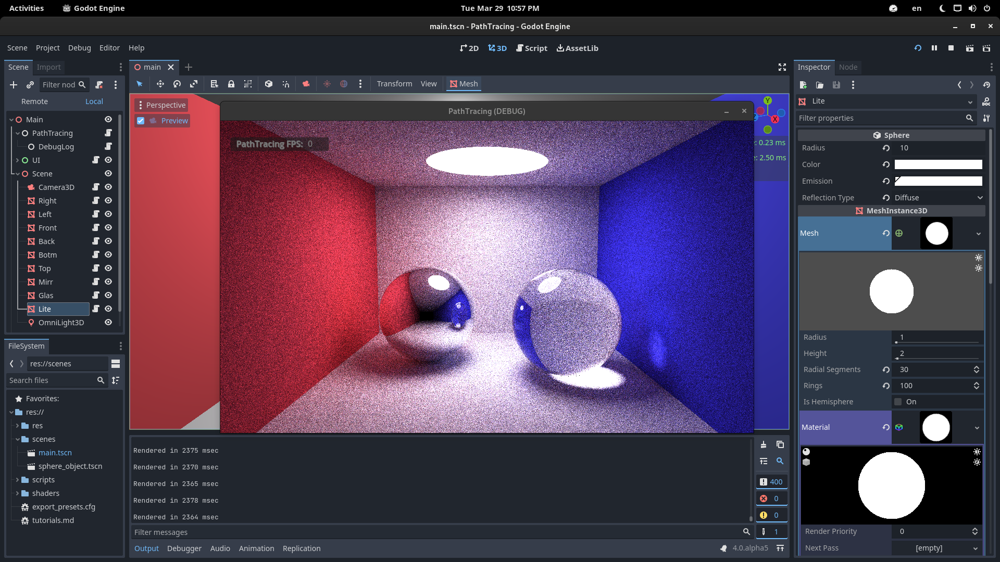
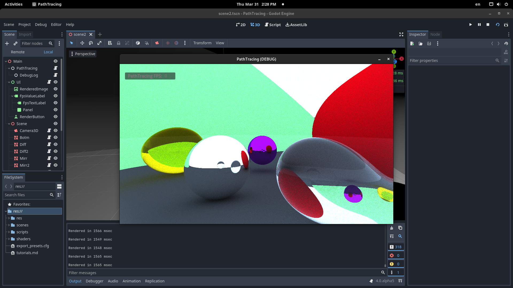

# godot-path-tracing

Using godot 4.0 (alpha 5 currently) for describing scene data and it's RenderingDevice for rendering scene in compute [shader](shaders/path_tracing.comp)

Ported c++ code from https://www.kevinbeason.com/smallpt

See other useful [links](tutorials.md)
  

My code seems very slow for some reason. Comparing to CPU implementation from [smallpt](shaders/cpp_example/forward.cpp).

I was searching for a way to get raw triangles data from render pipeline but couldn't figure it out. If you know something about it, please tell me :)
  

## Screenshots
 

  

